# Support Ticket System: Local to Docker to AWS and Azure

## Project report

This report documents the three versions of the Support Ticket System in this repository: the original local application, the Docker Compose version, and the cloud deployment using AWS for the application and Azure for PostgreSQL. It explains what changed at each stage, how a request travels through the system, and what the three deployment approaches have in common.

> **Deployment evidence note:** Cloud details and the successful deployment outcome below are based on the project’s existing deployment notes. Cloud resources, addresses, and health can change; this report does not claim to have checked the live AWS or Azure environments while it was written.

## 1. Project at a glance

The application is a Node.js and Express HTTP API backed by PostgreSQL. It exposes read endpoints for users and tickets. The project grew in three steps:

1. **Local:** develop and run the API directly on the developer’s computer.
2. **Docker:** put the API, PostgreSQL, and pgAdmin into separate containers coordinated by Docker Compose.
3. **Cloud:** run the API on AWS Elastic Beanstalk, which provisions and manages an underlying EC2 instance, and connect it to Azure Database for PostgreSQL Flexible Server.

The key idea is that the application’s purpose and most route/controller code remained the same. What changes from stage to stage is where the processes run, how PostgreSQL is provided, how the API finds and connects to the database, and how network access is controlled.

## 2. How the three stages evolved

```mermaid
flowchart TD
    subgraph LocalStage["Stage 1 - Local development"]
        LocalClient["Browser or API client"]
        LocalApi["Node.js and Express on computer"]
        LocalPostgres["PostgreSQL configured for local app"]
        LocalClient -->|"HTTP request"| LocalApi
        LocalApi -->|"DB environment settings"| LocalPostgres
    end
    subgraph DockerStage["Stage 2 - Docker Compose"]
        DockerClient["Browser or API client"]
        ApiContainer["API container"]
        DbContainer["PostgreSQL container"]
        AdminContainer["pgAdmin container"]
        DockerClient -->|"published port 3000"| ApiContainer
        ApiContainer -->|"postgres:5432 on Compose network"| DbContainer
        AdminContainer -->|"postgres:5432 on Compose network"| DbContainer
    end
    subgraph CloudStage["Stage 3 - AWS and Azure"]
        CloudClient["Browser or API client"]
        BeanstalkApp["Elastic Beanstalk Node.js environment"]
        Ec2Instance["Underlying EC2 instance"]
        AzureDb["Azure PostgreSQL Flexible Server"]
        CloudClient -->|"HTTP or HTTPS request"| BeanstalkApp
        BeanstalkApp -->|"runs on"| Ec2Instance
        Ec2Instance -->|"TLS PostgreSQL connection"| AzureDb
    end
```

<!-- mermaid-checked: no \n, no em-dash/en-dash, no {} in labels, subgraphs are id["label"], arrows are -->|"label"|, all subgraphs closed by end, ids unique -->


The local and Docker stages use the same basic API routes. Docker adds a repeatable container setup around the API and database. The cloud version keeps the route/controller structure, but adjusts how the app connects to PostgreSQL and how it starts and shuts down in a managed hosting environment.

## 3. Stage 1: Original local application

### Goal

The first version was a conventional local Node.js application. Node.js runs directly on the computer, and Express listens for HTTP requests. The PostgreSQL server is reached using connection settings supplied to the process as environment variables.

### Project structure

The core application files are:

```text
support-ticket-system/
├── package.json
├── package-lock.json
└── src/
    ├── app.js
    ├── config/
    │   └── db.js
    ├── controllers/
    │   ├── ticketsController.js
    │   └── usersController.js
    └── routes/
        ├── tickets.js
        └── users.js
```

`src/app.js` configures Express, registers the route modules, performs a database connectivity query, and starts the HTTP server. `src/routes/` maps URL paths to controller functions. `src/controllers/` contains the SQL queries and response handling. `src/config/db.js` creates a shared PostgreSQL connection pool using environment variables.

### Local request path

For `GET /api/users`, the local flow is:

1. The client sends an HTTP request to the Node.js server running on the computer.
2. Express in `src/app.js` matches the `/api/users` prefix and passes the remaining path to the users router.
3. `src/routes/users.js` selects the list or individual-user handler based on the HTTP method and path.
4. The matching function in `src/controllers/usersController.js` calls the shared `pg` pool.
5. The pool connects to the PostgreSQL host configured for this local run and executes a parameterized query.
6. The controller returns the selected rows as JSON.

The ticket endpoints use the same route/controller/pool structure. The ticket list query joins the ticket table to users to include creator and assignee names.

### Local database setup and configuration

The local project has a `.env` file and the database connection module expects `DB_HOST`, `DB_PORT`, `DB_NAME`, `DB_USER`, and `DB_PASSWORD`. This report intentionally does not reproduce any `.env` values. Keep those values out of documentation and source control.

The local folder does not include the Docker PostgreSQL initialization script or Compose database service. Therefore, local execution depends on a PostgreSQL server and a database/schema being available separately. The application code alone does not install or start PostgreSQL.

### Running the local application

From the `support-ticket-system` folder, the package scripts support:

```sh
npm install
npm start
```

For development, the project also defines `npm run dev`, which runs the app through nodemon. The database settings must be correct and PostgreSQL must be reachable before database-backed routes can work.

## 4. Stage 2: Containerized with Docker Compose

### Goal

The Docker version keeps the same Node.js API but packages the runtime and dependencies into an image. Docker Compose starts three independent services together:

- `api`: Node.js and Express application.
- `postgres`: PostgreSQL database.
- `pgadmin`: browser interface for database administration.

This makes the development setup more repeatable: instead of installing and separately launching each service, one Compose command can start the stack.

### What the Docker files do

| File | Purpose |
|---|---|
| `dockerfile` | Starts from `node:22-alpine`, sets `/app` as the working directory, copies package files, installs npm dependencies, copies the source, and starts `npm run dev`. |
| `compose.yaml` | Defines and connects the `api`, `postgres`, and `pgadmin` services, their ports, environment variables, mounts, and startup ordering. |
| `database/init.sql` | Creates the `users` and `tickets` tables and inserts sample records when PostgreSQL initializes a new, empty data directory. |
| `.dockerignore` | Excludes local-only items such as `node_modules`, `.env`, and `.git` from the Docker build context. |

### Docker network and ports

Compose creates a private network for these services. Services can connect to each other by service name; in this stack, the API and pgAdmin reach PostgreSQL using `postgres` as the hostname.

| Published mapping | What it means |
|---|---|
| `3000:3000` | The developer opens `http://localhost:3000`; Docker forwards the computer’s port 3000 to the API container’s port 3000. |
| `5433:5432` | A database program installed on the computer can use `localhost:5433`; PostgreSQL itself listens on container port 5432. |
| `5050:80` | The developer opens `http://localhost:5050`; Docker forwards to pgAdmin’s web port 80. |

From inside the API container, the database address is `postgres:5432`, not `localhost:5433`. Inside a container, `localhost` means that same container. pgAdmin also uses `postgres:5432` when registering this database.

### Docker data persistence and initialization

The API source directory is bind-mounted from the computer into `/app/src` in the API container. This supports development: edits on the host are visible in the container, and nodemon can restart the process.

The PostgreSQL data directory is stored in the named Docker volume `postgres_data`. That volume survives ordinary container stop/recreation, preserving database contents. The `database/init.sql` file is mounted into PostgreSQL’s initialization directory. The official image runs initialization scripts only when setting up an empty data directory, so editing the SQL file does not automatically change a database that already has data in its volume.

### Docker startup sequence

From the `support-ticket-system-for-docker` folder:

```sh
docker compose up --build
```

This asks Compose to build the API image and start the services. `depends_on` orders PostgreSQL before the API and pgAdmin, but service start order does not guarantee PostgreSQL is ready to accept connections. The current API makes a startup `SELECT NOW()` check and logs a database connection failure if that query cannot connect; it does not implement a retry loop.

The data can be deliberately reset with:

```sh
docker compose down -v
docker compose up --build
```

The `-v` option deletes Compose-managed volumes, including `postgres_data`, and therefore removes all database records in that volume. Do not use it unless a full local database reset is intended.

### What a request does in Docker

1. A browser or API client requests `http://localhost:3000/api/tickets`.
2. Docker forwards host port 3000 to the API container.
3. Express routes `/api/tickets` to the tickets router and then to the appropriate controller.
4. The controller uses the API container’s shared PostgreSQL pool.
5. Docker’s private Compose DNS resolves `postgres` to the PostgreSQL container.
6. PostgreSQL executes the query and returns rows over the internal network.
7. Express returns the result to the client as JSON.

pgAdmin is a parallel administrative path into PostgreSQL. It is not a proxy for API traffic and does not need to be running for API endpoints to return data.

## 5. Stage 3: AWS application and Azure PostgreSQL

### Goal and deployed arrangement

The cloud version moved the API to AWS and used a managed PostgreSQL service in Azure:

- **Application hosting:** AWS Elastic Beanstalk.
- **Compute:** an underlying Amazon EC2 instance managed as part of the Elastic Beanstalk environment.
- **Database:** Azure Database for PostgreSQL Flexible Server.
- **Recorded AWS region:** Asia Pacific (Mumbai), `ap-south-1`.
- **Recorded Azure region:** Canada Central.
- **Recorded application platform:** Node.js 24 on 64-bit Amazon Linux 2023.
- **Recorded environment type:** single instance, with a `t3.micro` instance type at the time described in the deployment guide.

Elastic Beanstalk is the application deployment and environment-management layer; EC2 is the virtual machine that executes the application. Azure PostgreSQL is a separate managed database service. This is a multi-cloud arrangement because compute and database services belong to different cloud providers.

### Provisioning and preparation flow

The existing deployment guide records this general sequence:

1. Create the Azure resource group and PostgreSQL Flexible Server.
2. Create the application database `support_ticket_db` on that server.
3. Create the `users` and `tickets` tables and seed test records.
4. Configure Azure networking/firewall rules so the intended client and AWS application environment can reach PostgreSQL on TCP port 5432.
5. Keep application configuration outside source code. Configure the database host, port, database name, username, password, and production environment in Elastic Beanstalk environment properties.
6. Package the Node.js application so `package.json`, `package-lock.json`, and `src/` are at the root of the ZIP file. The deployment notes describe replacing an initially problematic Windows-generated archive with a `tar.exe` archive whose paths worked for Elastic Beanstalk.
7. Upload and deploy the ZIP to the Elastic Beanstalk environment.
8. Wait for the environment update and check its health.
9. Test the root endpoint, database health endpoint, and database-backed API endpoints.

The cloud project folder has no `.env` file. The cloud deployment guide records the expected environment property names; the password is set privately in AWS rather than placed in this report.

### Cloud database connection path

When a user calls a database-backed route on the deployed API:

1. The client sends an HTTP/HTTPS request to the Elastic Beanstalk environment URL.
2. Elastic Beanstalk routes the request to the Node.js process running on its EC2 instance.
3. Express selects the users or tickets route and invokes the relevant controller.
4. The controller uses the `pg` connection pool in `src/config/db.js`.
5. The pool reads its connection settings from the Elastic Beanstalk environment.
6. The EC2 environment opens an encrypted PostgreSQL connection to the Azure server on TCP port 5432.
7. Azure networking/firewall rules must permit that source. PostgreSQL then authenticates the configured database user.
8. Azure PostgreSQL executes the query and returns results over the encrypted connection.
9. The controller sends the data to the API client as JSON.

These controls address different concerns: a firewall permits a network source to attempt a connection; the database username and password authenticate a role; database grants authorize operations; TLS encrypts traffic and, when certificate verification is enabled, verifies the server identity.

### Cloud-specific application changes

The cloud version keeps the users and tickets routes, but is not byte-for-byte identical to the local/Docker application:

- Its PostgreSQL pool enables TLS certificate verification, configures a connection timeout, and limits the pool size.
- Its server binds to `0.0.0.0`, making it reachable through the hosted environment’s network interface.
- It adds `GET /health/db`, which executes a database query and returns a connected/unavailable status.
- It closes the HTTP server and database pool when it receives shutdown signals.
- Its root response includes an environment indicator.

These are hosting and connection concerns, not a change to the core purpose of the users and tickets endpoints.

### Recorded success and its limits

The existing AWS/Azure deployment guide records that:

- The Elastic Beanstalk environment reached a healthy state after deployment and configuration.
- The root endpoint returned an application status response.
- The first database health check was unavailable before AWS environment properties and Azure firewall access were configured.
- After those settings were added, `GET /api/users` returned the three seeded sample user records from Azure PostgreSQL.

That response was evidence that the deployed API could reach and query the Azure database at that time. It does not prove the services are still running or reachable today. The deployment notes also leave a follow-up to recheck `/health/db` and test all ticket routes independently.

## 6. API behavior shared by the versions

The main HTTP paths are:

| Method | Path | Current behavior |
|---|---|---|
| `GET` | `/` | Returns a status message from the API process. |
| `GET` | `/api/users` | Returns a list of users. The query selects ID, name, email, role, and creation time, not the password column. |
| `GET` | `/api/users/:id` | Returns one user by ID, or a not-found response when no matching row exists. |
| `GET` | `/api/tickets` | Returns ticket rows with creator and assignee names by joining the `users` table. |
| `GET` | `/api/tickets/:id` | Returns one ticket by ID, or a not-found response when no matching row exists. |
| `GET` | `/health/db` | In the cloud version, runs a database query and returns a connection status. This route is not in the local/Docker `app.js` copies. |

The current code is primarily read-only. The table names and sample data do not mean ticket CRUD, authentication, or authorization is implemented. There are no current POST/PATCH/DELETE routes in these three project copies.

## 7. Side-by-side comparison of the three applications

| Topic | Local application | Docker application | AWS and Azure cloud application |
|---|---|---|---|
| Project folder | `support-ticket-system/` | `support-ticket-system-for-docker/` | `support-ticket-system-for-azure-aws/` |
| Where Node.js runs | Directly on the developer’s computer | In the `api` container | In the Elastic Beanstalk environment on its underlying EC2 instance |
| Where PostgreSQL runs | Separately configured PostgreSQL server; not provisioned by this project folder | `postgres` Docker container | Azure Database for PostgreSQL Flexible Server |
| How components find the database | Values in process environment / `.env` | Compose variables; hostname `postgres`, port `5432` | Elastic Beanstalk environment properties; Azure server hostname, port `5432` |
| Network path | Local process to configured DB endpoint | API container to database container over Compose network | AWS EC2 environment to Azure over the network using TLS and Azure firewall rules |
| Database initialization | No local SQL bootstrap script in this folder; schema must be available separately | `database/init.sql` creates and seeds a fresh database volume | Database/schema setup is described in the cloud deployment and Azure connection guides |
| Persistence | Depends on the separately configured local PostgreSQL server | Docker named volume `postgres_data` | Managed Azure database storage and service configuration |
| Admin tool | No admin UI defined in the app folder | pgAdmin container, host port 5050 | Azure portal plus external tools such as pgAdmin or `psql` |
| API endpoints | Root, users, and tickets read endpoints | Same route set as local | Same users/tickets routes plus `/health/db` in the current cloud `app.js` |
| Database connection security | Basic `pg` pool configuration | Basic `pg` pool configuration for local development | Pool enables TLS certificate verification and a connection timeout |
| Typical startup/deploy | `npm start` or `npm run dev` | `docker compose up --build` | Upload application ZIP and deploy through Elastic Beanstalk |
| Main benefit | Fastest feedback while coding | Repeatable, isolated local stack | Application reachable from the cloud with a managed cloud database |
| Main operational concern | Local DB must already be installed/configured and reachable | Manage container lifecycle and avoid accidentally deleting the data volume | Manage AWS/Azure networking, secrets, costs, TLS, and two providers |

### What stayed the same

- Node.js and Express remain the API runtime and HTTP framework.
- The route modules and controller-based organization are retained.
- The users and tickets queries still use PostgreSQL through the `pg` package.
- The API returns JSON to the client.

### What changed

- **Execution location:** host computer, then containers, then AWS-managed environment/EC2.
- **Database location:** separately configured local database, then a PostgreSQL container, then Azure-managed PostgreSQL.
- **Service discovery:** local connection settings, then Compose DNS name `postgres`, then Azure database hostname.
- **Configuration delivery:** local environment file/process settings, Compose service environment, then Elastic Beanstalk environment properties.
- **Network/security needs:** local reachability, then container network and port mappings, then cross-cloud firewall policy and TLS.
- **Operations:** manually start processes, start the Compose stack, then deploy and monitor cloud resources.

## 8. Important learning points

1. **A container is not the same as a virtual machine.** In the Docker version, the API and database have separate containers, but Compose makes them feel like one coordinated application.
2. **A container has its own `localhost`.** The API container connects to the `postgres` service name, not to itself.
3. **Host and container ports are different sides of a mapping.** For example, a host database tool uses port 5433 while another Compose service uses the database container’s port 5432.
4. **Container lifetime and database lifetime are different.** A container can be recreated while a named volume preserves PostgreSQL data.
5. **Managed services still need configuration.** Azure runs PostgreSQL for you, but the application still requires a valid endpoint, credentials, network access, permissions, and TLS.
6. **A healthy web endpoint does not prove the database is healthy.** The cloud `/health/db` route is a separate check that actually queries PostgreSQL.
7. **Cross-cloud works, but adds complexity.** AWS-to-Azure communication can require firewall changes, stable network egress, TLS setup, cost monitoring, and investigation across both providers.
8. **Demo credentials and seed records are not production-safe.** Keep secrets out of Git and documentation, avoid plaintext passwords, and apply least privilege before using real data.

## 9. Security and operations notes

- Do not paste `.env` contents, database passwords, access keys, or secret connection strings into reports, source control, issue trackers, or chat.
- The Docker Compose file contains demonstration credentials directly in configuration. Replace this approach with protected secret handling before any shared or production deployment.
- Do not open a cloud database firewall to all public addresses for convenience. Allow only the required sources, and verify addresses when the AWS environment changes.
- The deployment notes record public network connectivity between AWS and Azure. For a production architecture, assess private networking, egress costs, latency, backups, database least privilege, and whether locating the API and database together is more appropriate.
- The cloud deployment notes describe a single-instance learning environment. Add resilience, monitoring, backups, authentication, authorization, input validation, and budget alerts before treating this as a production ticketing service.
- Cloud prices, regions, available platform versions, and recorded public network addresses are time-sensitive. Check the current provider consoles and billing dashboards.
- Removing Docker volumes or deleting cloud resources can permanently delete database data. Back up anything important before cleanup.

## 10. Supporting project documentation

- [Docker architecture guide](./support-ticket-system-for-docker/architecture-diagram.md) explains the Compose containers, routes, ports, volumes, and API request path.
- [AWS and Azure deployment guide](./support-ticket-system-for-azure-aws/support-ticket-system-aws-azure-guide.md) records the Elastic Beanstalk deployment, Azure connection, tests, troubleshooting, and cleanup considerations.
- [Azure PostgreSQL connection guide](./support-ticket-system-for-azure-aws/azure-postgresql-connection-guide.md) describes Azure PostgreSQL setup and connecting with pgAdmin, `psql`, or VS Code.

## 11. Final comparison and project outcome

The three folders represent a learning progression rather than three unrelated applications:

- **Local** established the API and its users/tickets database access.
- **Docker** made the API, PostgreSQL, and pgAdmin runnable together as a repeatable local stack.
- **Cloud** demonstrated that the API can run on AWS while its PostgreSQL database is hosted by Azure, with cloud environment configuration, a firewall-approved network path, and an encrypted database connection.

The existing deployment record reports a successful cloud test in which the AWS-hosted API returned user rows stored in Azure PostgreSQL. This is the main end-to-end achievement: a client request reached an application in AWS, the application queried a managed database in Azure, and the API returned the result. The cloud deployment is a valuable learning milestone; it should not be described as production-ready until the security, operational, and resiliency items above are addressed.
