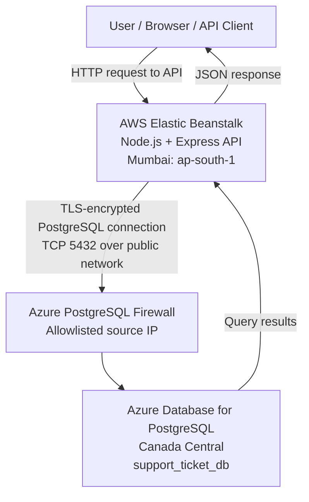
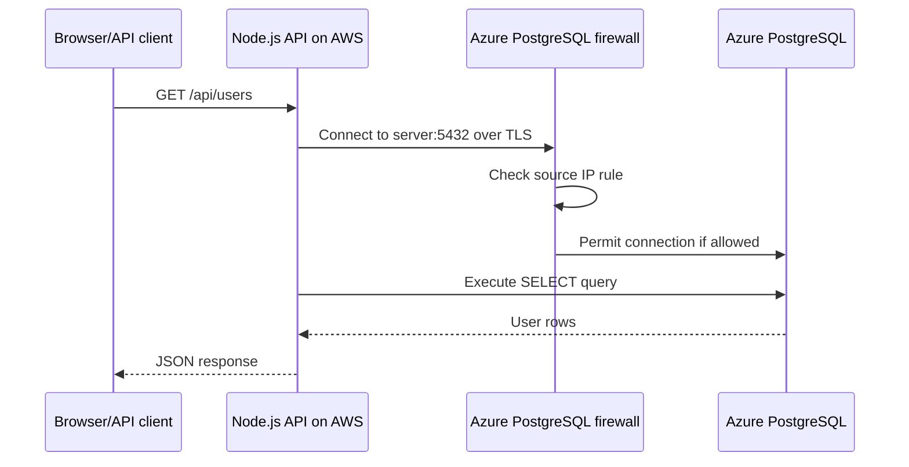

# Support Ticket System on AWS + Azure PostgreSQL
## End-to-End Cloud Deployment Guide

> **Project:** Support Ticket System API  
> **Application:** Node.js + Express  
> **Hosting:** AWS Elastic Beanstalk (Amazon Linux 2023, Node.js 24)  
> **Database:** Azure Database for PostgreSQL Flexible Server  
> **AWS Region:** Asia Pacific (Mumbai), `ap-south-1`  
> **Azure Region:** Canada Central  
> **Purpose:** A practical record of the learning deployment, architecture, configuration, tests, troubleshooting, security, and cost considerations.

---

## Table of Contents

1. [Project Overview](#1-project-overview)
2. [Architecture](#2-architecture)
3. [What We Built](#3-what-we-built)
4. [Cloud Concepts Learned](#4-cloud-concepts-learned)
5. [Prerequisites](#5-prerequisites)
6. [Azure PostgreSQL Setup](#6-azure-postgresql-setup)
7. [Database Schema](#7-database-schema)
8. [Node.js Application Structure](#8-nodejs-application-structure)
9. [Application Configuration](#9-application-configuration)
10. [Deploying to AWS Elastic Beanstalk](#10-deploying-to-aws-elastic-beanstalk)
11. [Connecting AWS to Azure](#11-connecting-aws-to-azure)
12. [Testing the Deployment](#12-testing-the-deployment)
13. [Troubleshooting](#13-troubleshooting)
14. [Security Hardening](#14-security-hardening)
15. [Cost Management and Cleanup](#15-cost-management-and-cleanup)
16. [Next Development Milestones](#16-next-development-milestones)
17. [Quick Reference](#17-quick-reference)
18. [Glossary](#18-glossary)

---

## 1. Project Overview

The goal was to learn cloud computing by building and deploying a useful application instead of only exploring cloud dashboards.

We chose a **Support Ticket System**. Users can create support tickets, and support agents can review, assign, and update them. This deployment established the first foundation: a Node.js API hosted in AWS that reads user records from a PostgreSQL database hosted in Azure.

### Final outcome

The deployed `GET /api/users` endpoint returned three user records from the Azure PostgreSQL database. The application root endpoint also returned:

```json
{
  "message": "Support Ticket System API is running",
  "environment": "production"
}
```

The `/health/db` endpoint initially returned `unavailable` before the database firewall and AWS environment properties were configured. After configuration, `/api/users` returned database records, which is evidence that the end-to-end connection was working at that time.

> **Scope note:** This is a learning deployment, not a production-ready service. Authentication, authorization, request validation, secrets management, monitoring, and a security review remain important next steps.

---

## 2. Architecture

### 2.1 High-level architecture



### 2.2 Request lifecycle

1. A client requests an endpoint such as `GET /api/users`.
2. AWS Elastic Beanstalk runs the Node.js application.
3. Express matches the request to the relevant route.
4. The route/controller issues a SQL query through the Node.js `pg` library.
5. The connection pool connects to Azure PostgreSQL using environment variables.
6. Azure's firewall checks the source IP against its configured firewall rules.
7. PostgreSQL returns the query results.
8. Express sends the results to the client as JSON.

### 2.3 Services and responsibilities

| Component | Role |
|---|---|
| AWS Elastic Beanstalk | Deploys and manages the Node.js application environment |
| Amazon EC2 | Runs the Elastic Beanstalk application instance |
| Azure Database for PostgreSQL | Stores users and tickets |
| Azure firewall rules | Restrict which public IP addresses can connect to the database |
| Express | HTTP API framework |
| `pg` | PostgreSQL client for Node.js |
| Environment properties | Supply database connection settings without hardcoding them into source code |

### 2.4 Deployment facts recorded during the project

| Setting | Value |
|---|---|
| AWS application | `support-ticket-system` |
| Elastic Beanstalk environment | `Support-ticket-system-env` |
| AWS region | `ap-south-1` (Mumbai) |
| Platform | Node.js 24 on 64-bit Amazon Linux 2023 |
| Environment type | Single instance |
| Instance type | `t3.micro` |
| Environment URL | `https://Support-ticket-system-env.eba-2fjrmvug.ap-south-1.elasticbeanstalk.com` |
| Azure resource group | `support-ticket-rg` |
| Azure PostgreSQL server | `support-ticket-postgres-2026` |
| Azure database | `support_ticket_db` |
| Azure region | Canada Central |
| PostgreSQL port | `5432` |

Cloud resources, public IPs, URLs, prices, and platform options can change. Verify current values in the relevant console before relying on them.

---

## 3. What We Built

The application has these route groups:

- `GET /` — returns an application status message.
- `GET /health/db` — attempts a database query and reports whether the database is reachable.
- `/api/users` — user-related API routes.
- `/api/tickets` — support-ticket API routes.

The deployed `GET /api/users` endpoint returned three sample users:

```json
[
  {
    "id": 1,
    "name": "John Doe",
    "email": "john@example.com",
    "role": "user",
    "created_at": "2026-10-09T06:29:03.734Z"
  },
  {
    "id": 2,
    "name": "Alice Smith",
    "email": "alice@example.com",
    "role": "agent",
    "created_at": "2026-10-09T06:29:03.734Z"
  },
  {
    "id": 3,
    "name": "Admin User",
    "email": "admin@example.com",
    "role": "admin",
    "created_at": "2026-10-09T06:29:03.734Z"
  }
]
```

These are sample learning records. Do not use real personal data in an unsecured endpoint.

---

## 4. Cloud Concepts Learned

### 4.1 Cloud provider vs. service

AWS and Azure are cloud providers. Elastic Beanstalk is an application platform service in AWS; Azure Database for PostgreSQL is a managed database service in Azure.

### 4.2 Managed application platform

Elastic Beanstalk helps deploy and manage an application environment. It provisions underlying resources, including an EC2 instance, and provides environment health and deployment controls. It does not remove the need to understand networking, configuration, security, and costs.

### 4.3 Managed database

Azure manages much of the database infrastructure, according to the selected service and configuration. The application still needs valid credentials, a network path, firewall permission, and correct TLS configuration.

### 4.4 Firewall vs. credentials vs. TLS

These solve different problems:

- **Firewall:** determines whether a network source may attempt a connection.
- **Database authentication:** verifies the database username and password.
- **Database authorization:** determines which operations the authenticated role may perform.
- **TLS:** encrypts traffic and verifies the server certificate when configured correctly.

A firewall rule alone does not grant database access.

### 4.5 Environment variables

Environment variables let configuration differ between local development and deployment. The app reads `DB_HOST`, `DB_PORT`, `DB_NAME`, `DB_USER`, and `DB_PASSWORD` at runtime. The password should never be committed to Git or embedded in the ZIP package.

### 4.6 Multi-cloud trade-offs

This project uses AWS for compute and Azure for data storage. It is a useful learning exercise, but the services communicate over a public network with TLS and an IP allowlist. Cross-cloud and cross-region connections can introduce latency, egress charges, and operational complexity. For production, evaluate private networking and whether both components should be placed in the same cloud or region.

---

## 5. Prerequisites

- AWS account with access to Elastic Beanstalk and EC2.
- Azure subscription with permission to create a resource group and PostgreSQL Flexible Server.
- Node.js and npm installed locally.
- A code editor and terminal.
- A PostgreSQL client such as `psql` or a GUI client (optional).
- A database administrator password stored securely.
- Basic familiarity with HTTP APIs, SQL, and environment variables.

**Cost warning:** Cloud services may incur charges even when used only for learning. Review current pricing and account credit/Free Plan terms before provisioning resources.

---

## 6. Azure PostgreSQL Setup

### 6.1 Resource group and server

The project used:

- Resource group: `support-ticket-rg`
- PostgreSQL Flexible Server: `support-ticket-postgres-2026`
- Region: Canada Central
- Database name: `support_ticket_db`
- Server hostname: `support-ticket-postgres-2026.postgres.database.azure.com`
- Port: `5432`
- Administrator username used by the app during this learning setup: `supportadmin`

The version shown during setup was 18.x. Azure's supported versions and portal choices can change, so check the server's Overview page for the current version.

### 6.2 Create the database

In Azure Portal:

1. Open the PostgreSQL Flexible Server resource.
2. Open the **Databases** page.
3. Create `support_ticket_db` if it does not already exist.
4. Record the hostname, database name, username, and port securely.
5. Keep the password private.

### 6.3 Networking and firewall rules

The server was configured for public network access with firewall rules.

The developer's laptop firewall rule was:

| Rule | Start IP | End IP |
|---|---|---|
| `ClientIPAddress_2026-10-9_10-4-20` | `203.200.211.214` | `203.200.211.214` |

A second rule was added for the AWS application instance:

| Rule | Start IP | End IP |
|---|---|---|
| `AllowAWSBeanstalk` | `15.252.220.164` | `15.252.220.164` |

The AWS address was supplied from EC2/Elastic Beanstalk information during the deployment. **Verify that this address is still associated with the active environment before reusing it.** If the instance is replaced or the address changes, the rule may need updating. An Elastic IP is generally more stable than an automatically assigned public IPv4 address, but its association should still be verified.

#### Recommended firewall practices

- Allow only required source IP addresses.
- Do not create a rule allowing every IP (`0.0.0.0` through `255.255.255.255`) for convenience.
- Do not enable broad Azure-service access unless the design requires it.
- Review and remove temporary developer-IP rules when no longer needed.
- Public network access with an IP allowlist is not the same as private networking.

### 6.4 Connection settings

```text
Host:     support-ticket-postgres-2026.postgres.database.azure.com
Port:     5432
Database: support_ticket_db
User:     supportadmin
```

The password is intentionally not documented.

---

## 7. Database Schema

The project created two core tables: `users` and `tickets`.

### 7.1 Users table

```sql
CREATE TABLE users (
    id SERIAL PRIMARY KEY,
    name VARCHAR(100) NOT NULL,
    email VARCHAR(255) NOT NULL UNIQUE,
    password VARCHAR(255) NOT NULL,
    role VARCHAR(20) NOT NULL DEFAULT 'user',
    created_at TIMESTAMP DEFAULT CURRENT_TIMESTAMP
);
```

| Column | Purpose |
|---|---|
| `id` | Unique user identifier |
| `name` | User's display name |
| `email` | Unique email address |
| `password` | Store a password hash here; never store plaintext passwords in a real application |
| `role` | Role such as `user`, `agent`, or `admin` |
| `created_at` | Record creation timestamp |

### 7.2 Tickets table

```sql
CREATE TABLE tickets (
    id SERIAL PRIMARY KEY,
    title VARCHAR(255) NOT NULL,
    description TEXT NOT NULL,
    status VARCHAR(20) NOT NULL DEFAULT 'open',
    priority VARCHAR(20) NOT NULL DEFAULT 'medium',
    created_by INTEGER NOT NULL,
    assigned_to INTEGER,
    created_at TIMESTAMP DEFAULT CURRENT_TIMESTAMP,
    updated_at TIMESTAMP DEFAULT CURRENT_TIMESTAMP,
    CONSTRAINT fk_ticket_creator
        FOREIGN KEY (created_by) REFERENCES users (id),
    CONSTRAINT fk_ticket_assignee
        FOREIGN KEY (assigned_to) REFERENCES users (id)
);
```

| Column | Purpose |
|---|---|
| `id` | Unique ticket identifier |
| `title` | Short issue summary |
| `description` | Detailed issue description |
| `status` | Workflow status; defaults to `open` |
| `priority` | Importance; defaults to `medium` |
| `created_by` | User who created the ticket |
| `assigned_to` | Assigned user/agent; nullable |
| `created_at` | Creation timestamp |
| `updated_at` | Last-update timestamp; application logic should maintain it |

Foreign keys ensure that ticket creators and assignees refer to existing users.

### 7.3 Sample data

The database contains sample users:

- John Doe — `user`
- Alice Smith — `agent`
- Admin User — `admin`

Treat sample data and test credentials as disposable. If passwords were inserted as plaintext during early experimentation, replace them with properly hashed values before implementing real authentication.

---

## 8. Node.js Application Structure

The local project folder was:

```text
support-ticket-system-for-azure/
├── package.json
├── package-lock.json
└── src/
    ├── app.js
    ├── config/
    │   └── db.js
    ├── controllers/
    │   ├── ticketsController.js
    │   └── usersController.js
    └── routes/
        ├── tickets.js
        └── users.js
```

### 8.1 `package.json`

The project needs a start script Elastic Beanstalk can use:

```json
{
  "scripts": {
    "start": "node src/app.js"
  }
}
```

This is an excerpt, not a replacement for the full `package.json`. Keep the dependencies and metadata already present. The application uses at least:

- `express`
- `pg`
- `dotenv`

Keep `package-lock.json` with the source package for reproducible dependency installation.

### 8.2 Express application (`src/app.js`)

The deployed app's core setup was:

```js
require("dotenv").config();

const express = require("express");
const pool = require("./config/db");

const usersRoutes = require("./routes/users");
const ticketsRoutes = require("./routes/tickets");

const app = express();
const PORT = process.env.PORT || 3000;

app.use(express.json());

app.get("/", (req, res) => {
    res.json({
        message: "Support Ticket System API is running",
        environment: process.env.NODE_ENV || "production"
    });
});

app.get("/health/db", async (req, res) => {
    try {
        const result = await pool.query("SELECT NOW() AS database_time");
        res.json({
            status: "connected",
            databaseTime: result.rows[0].database_time
        });
    } catch (error) {
        console.error("Database health check failed:", error.message);
        res.status(503).json({
            status: "unavailable",
            error: "Database connection failed"
        });
    }
});

app.use("/api/users", usersRoutes);
app.use("/api/tickets", ticketsRoutes);

const server = app.listen(PORT, "0.0.0.0", () => {
    console.log(`Support Ticket API listening on port ${PORT}`);
});

async function shutdown() {
    server.close(async () => {
        await pool.end();
        process.exit(0);
    });
}

process.on("SIGTERM", shutdown);
process.on("SIGINT", shutdown);
```

Key details:

- `process.env.PORT` lets the hosting platform supply the port.
- `0.0.0.0` binds the app to all network interfaces.
- `express.json()` parses JSON request bodies.
- `/health/db` performs a real database query.
- The shutdown handler closes the HTTP server and PostgreSQL pool.

### 8.3 PostgreSQL connection pool (`src/config/db.js`)

```js
const { Pool } = require("pg");

const pool = new Pool({
    host: process.env.DB_HOST,
    port: Number(process.env.DB_PORT || 5432),
    database: process.env.DB_NAME,
    user: process.env.DB_USER,
    password: process.env.DB_PASSWORD,
    ssl: { rejectUnauthorized: true },
    connectionTimeoutMillis: 10000,
    max: 5
});

module.exports = pool;
```

A pool reuses database connections rather than creating a new connection for every request. `max: 5` limits the pool to five connections per application process. Tune this according to the database's connection limit and the number of application instances.

TLS certificate verification is enabled by `rejectUnauthorized: true`. Do not disable certificate verification as a routine fix for connection errors. If a certificate issue appears, configure the correct trusted CA certificate chain for the Azure PostgreSQL endpoint.

### 8.4 Routes and controllers

Route files map HTTP paths and methods to controller functions. Controllers execute database queries and return responses. Use parameterized SQL (`$1`, `$2`, and so on) for client-supplied values. Do not concatenate untrusted input into SQL strings.

---

## 9. Application Configuration

### 9.1 Local development `.env`

A local `.env` file can provide development settings:

```dotenv
DB_HOST=support-ticket-postgres-2026.postgres.database.azure.com
DB_PORT=5432
DB_NAME=support_ticket_db
DB_USER=supportadmin
DB_PASSWORD=replace_with_your_password
NODE_ENV=development
```

This is a template only. Replace the placeholder locally; never publish the real password.

Add `.env` to `.gitignore`:

```gitignore
.env
node_modules/
```

Do not put `.env` inside the deployment ZIP.

### 9.2 Elastic Beanstalk environment properties

In AWS Console:

1. Open **Elastic Beanstalk**.
2. Select application `support-ticket-system`.
3. Open environment `Support-ticket-system-env`.
4. Open **Configuration**.
5. Find **Software** (console layout can vary) and click **Edit**.
6. Add these environment properties:

| Property | Value |
|---|---|
| `DB_HOST` | `support-ticket-postgres-2026.postgres.database.azure.com` |
| `DB_PORT` | `5432` |
| `DB_NAME` | `support_ticket_db` |
| `DB_USER` | `supportadmin` |
| `DB_PASSWORD` | Enter the password privately in the AWS Console |
| `NODE_ENV` | `production` |

7. Apply/save the configuration and wait for the environment update.
8. Confirm the environment health is `Ok`.

Do not add `PORT` unless specifically required; the application already uses the platform-provided value when available.

Environment properties are convenient for learning but are not a complete secrets-management solution. For production, consider AWS Secrets Manager or another approved secret store and restrict access to secret values.

---

## 10. Deploying to AWS Elastic Beanstalk

### 10.1 Environment creation

The project was deployed to an Elastic Beanstalk environment in Mumbai:

- Application: `support-ticket-system`
- Environment: `Support-ticket-system-env`
- Platform: Node.js 24 on 64-bit Amazon Linux 2023
- Instance type: `t3.micro`
- Environment type: single instance

Console labels and supported platform versions may change. When creating a new environment, choose a currently supported Node.js platform and verify the instance type and cost.

### 10.2 Prepare the deployment archive

The local source folder was:

```text
C:\Users\Exaze\OneDrive - EXAZEIT\Desktop\Cloud\support-ticket-system-for-azure
```

The ZIP package must have `package.json` and `src/` at the archive root, not nested under an extra parent folder.

A Windows PowerShell command that worked in this project was:

```powershell
Remove-Item ..\support-ticket-system.zip -ErrorAction SilentlyContinue
tar.exe -a -c -f ..\support-ticket-system.zip package.json package-lock.json src
```

Run this from the project folder, then inspect the archive:

```powershell
tar.exe -tf ..\support-ticket-system.zip
```

Expected layout:

```text
package.json
package-lock.json
src/
src/app.js
src/config/
src/controllers/
src/routes/
```

The listing can include individual files under the folders. The important points are that paths use forward slashes and `package.json` is at the ZIP root.

### 10.3 Deployment issue and resolution

The first ZIP made with `Compress-Archive` was rejected because its entries used Windows backslashes in paths. Elastic Beanstalk logs warned that paths appeared to use backslashes as separators, followed by an unzip/staging failure.

**Resolution:** recreate the ZIP with `tar.exe`, inspect it with `tar.exe -tf`, and upload the corrected archive.

### 10.4 Upload and deploy

1. Open the Elastic Beanstalk environment.
2. Choose **Upload and deploy**.
3. Select the ZIP archive.
4. Enter a version label, such as `support-ticket-v2`.
5. Start deployment.
6. Wait until the environment reports healthy.
7. Open the environment URL and test `/`.

Use the URL displayed by the current environment page if the environment is recreated.

---

## 11. Connecting AWS to Azure

The app and database are in different cloud providers. The connection requires all of the following:

1. **Correct hostname:** the Azure PostgreSQL server FQDN.
2. **Network reachability:** AWS must be able to connect outbound to the Azure endpoint on TCP port `5432`.
3. **Azure firewall:** the connection's source public IP must be allowed.
4. **Credentials:** valid database username and password.
5. **Database name:** `support_ticket_db`.
6. **TLS:** encrypted connection and certificate verification.
7. **Application configuration:** all `DB_*` environment properties must match.

### Connection sequence



### Why the first database health check failed

Before the firewall rule and AWS environment properties were configured, `/health/db` returned:

```json
{
  "status": "unavailable",
  "error": "Database connection failed"
}
```

That response alone did not identify the root cause; the endpoint deliberately hides low-level details from the client. Areas to check include firewall access, environment variables, credentials, TLS, and outbound networking.

After configuration, `/api/users` returned database records. That successful query is evidence that the end-to-end connection worked at that time.

---

## 12. Testing the Deployment

Use the environment's current HTTPS URL. The project URL recorded at the time of writing was:

`https://Support-ticket-system-env.eba-2fjrmvug.ap-south-1.elasticbeanstalk.com`

### 12.1 Root endpoint

Request:

```http
GET /
```

Expected response:

```json
{
  "message": "Support Ticket System API is running",
  "environment": "production"
}
```

This confirms that the Node.js process responds; it does not by itself prove database connectivity.

### 12.2 Database health endpoint

Request:

```http
GET /health/db
```

Expected successful response:

```json
{
  "status": "connected",
  "databaseTime": "..."
}
```

The timestamp varies. If it returns HTTP `503` and `status: unavailable`, investigate the connection using the troubleshooting section.

### 12.3 Users endpoint

Request:

```http
GET /api/users
```

The project successfully returned three sample users. Exact fields depend on the route/controller implementation.

### 12.4 Tickets endpoint

Request:

```http
GET /api/tickets
```

Test this route separately. If it returns an error, inspect the response and application logs; the problem could be specific to the ticket query or schema rather than the connection itself.

### 12.5 HTTPS

The environment also responded over HTTP during initial testing. Use HTTPS for normal access. Before using this as a real service, verify TLS, redirect behavior, authentication, and any custom-domain setup.

---

## 13. Troubleshooting

| Symptom | Possible cause | Action |
|---|---|---|
| `Cannot GET /helalth/db` | Typo in the path | Use `/health/db` |
| Root endpoint works, DB health returns `503` | DB settings, firewall, credentials, TLS, or outbound networking | Review Elastic Beanstalk logs and environment properties |
| Connection times out | Firewall rule or network route | Verify the active AWS egress IP is allowlisted; check outbound networking |
| Password authentication failed | Wrong username/password or authentication configuration | Re-enter credentials securely and verify the server's admin username |
| Database does not exist | Wrong `DB_NAME` or database missing | Confirm `support_ticket_db` exists |
| TLS/certificate error | CA trust chain or hostname mismatch | Verify the Azure hostname and configure the correct CA trust; don't disable verification as a shortcut |
| `Cannot GET /api/users` | Route mount/path mismatch or wrong deployed version | Check `src/app.js`, route definitions, and deployed version |
| ZIP staging/unzip failure | Archive paths or root layout | Inspect with `tar.exe -tf` and rebuild with correct paths |
| Environment health degraded | App crash, failed deployment, or health-check issue | Review Elastic Beanstalk Events and logs |

### Useful diagnostic pages

- **Elastic Beanstalk → Environment → Events:** deployment and configuration events.
- **Elastic Beanstalk → Logs:** application/platform logs.
- **EC2 → Instances:** verify the instance associated with the environment and its current public IP/EIP.
- **Azure PostgreSQL → Networking:** verify public access and firewall rules.
- **Azure PostgreSQL → Overview:** verify hostname, server state, and region.

Never paste passwords, secret-bearing connection strings, or full secret values into logs or chat.

---

## 14. Security Hardening

This is a learning milestone. Complete the following before using real customers or sensitive information.

### 14.1 Authentication and authorization

- Add secure login and session/token management.
- Hash passwords with a suitable password-hashing algorithm such as Argon2id or bcrypt.
- Never return password hashes from user endpoints.
- Enforce role-based access control on the server, not just in a frontend.
- Limit users to viewing/updating only tickets they are authorized to access.
- Add rate limiting and abuse protections to authentication endpoints.

### 14.2 Database permissions

The learning deployment uses `supportadmin` as the application database user. For production, create a separate least-privilege application role with only the required permissions. Avoid using the server administrator account from an internet-facing app.

### 14.3 Secrets

- Never commit `.env` files or passwords.
- Rotate any password that was exposed or committed.
- Restrict who can view or update Elastic Beanstalk environment properties.
- Consider a managed secrets service and controlled rotation.

### 14.4 Network and transport security

- Keep Azure firewall rules restricted to required source addresses.
- Verify the AWS IP/EIP association after instance replacement or environment changes.
- Keep PostgreSQL TLS certificate verification enabled.
- Prefer appropriately designed private connectivity for production cross-cloud access where feasible.
- Avoid unauthenticated API endpoints that return user information.

### 14.5 API and data handling

- Validate request bodies and query parameters.
- Use parameterized SQL.
- Return appropriate HTTP status codes.
- Avoid leaking database details to clients.
- Add pagination to list endpoints.
- Maintain `updated_at` on ticket updates.
- Add audit logging for important ticket operations.
- Configure backups and test restore procedures.

### 14.6 HTTPS

The default environment URL is fine for learning tests. For production, configure and validate HTTPS behavior, certificates, domain requirements, and HTTP-to-HTTPS redirects as appropriate.

---

## 15. Cost Management and Cleanup

### 15.1 Costs to monitor

This project spans two providers. Check both billing dashboards:

- AWS Elastic Beanstalk and its EC2 instance.
- Public IPv4/EIP-related charges under current AWS pricing.
- Data transfer/egress between AWS and Azure.
- Azure PostgreSQL compute and storage.
- Logs, backups, monitoring, or networking resources.

Credits and Free Plan terms vary by account and date. Check current AWS Billing and Azure Cost Management rather than relying on old estimates.

During the project, the Azure estimate shown was approximately **US$58.08/month** for the selected database configuration. This was an estimate at that time, not a guaranteed current charge. Azure credits were reported to expire on **October 29, 2026**; verify the current balance and expiry in the portal.

### 15.2 Stop vs. delete

- Stopping a compute resource may reduce compute charges but may not eliminate storage, IP, backup, or other charges. Behavior varies by service.
- Deleting a resource can permanently remove it or make data unrecoverable, depending on the service and backup configuration.
- Deleting the Elastic Beanstalk environment does not automatically mean the Azure database has been deleted.
- Deleting the Azure database/server can remove data and may be difficult or impossible to reverse without a valid backup.

Before deleting anything:

1. Decide whether the data is needed.
2. Export or back up the database if needed.
3. Check dependent resources.
4. Delete only resources you intend to remove.
5. Recheck AWS and Azure cost dashboards afterward.

---

## 16. Next Development Milestones

A useful order for continuing the Support Ticket System:

### Milestone 1 — Complete ticket CRUD

- `POST /api/tickets` — create a ticket.
- `GET /api/tickets` — list tickets with pagination.
- `GET /api/tickets/:id` — retrieve one ticket.
- `PATCH /api/tickets/:id` — update status, priority, or assignment.
- `DELETE /api/tickets/:id` — only if the intended workflow permits deletion.

### Milestone 2 — Authentication

- Registration and login.
- Password hashing.
- Session or token management.
- Role-based access control for `user`, `agent`, and `admin`.

### Milestone 3 — Validation and errors

- Validate fields and allowed values.
- Return correct HTTP status codes.
- Handle missing records and duplicate email addresses.
- Add centralized error middleware.

### Milestone 4 — Frontend

Build a simple UI for login, ticket creation, ticket list and filters, ticket details, and agent assignment/status changes.

### Milestone 5 — Operational readiness

- Add structured logging and metrics.
- Configure database backups and test restores.
- Set budget alerts in AWS and Azure.
- Store secrets securely.
- Review network access and least-privilege IAM.
- Set up CI/CD after manual deployment and rollback are understood.

---

## 17. Quick Reference

### Endpoints

| Purpose | Path |
|---|---|
| Application status | `/` |
| Database health | `/health/db` |
| Users API | `/api/users` |
| Tickets API | `/api/tickets` |

Append each path to the deployed environment's HTTPS base URL.

### AWS environment properties

```text
DB_HOST=support-ticket-postgres-2026.postgres.database.azure.com
DB_PORT=5432
DB_NAME=support_ticket_db
DB_USER=supportadmin
DB_PASSWORD=<set privately; never document the value>
NODE_ENV=production
```

### Azure networking

- PostgreSQL port: `5432`
- Developer firewall rule: `203.200.211.214` to `203.200.211.214`
- AWS firewall rule recorded during setup: `15.252.220.164` to `15.252.220.164`
- Confirm the AWS address is still correct before reusing the rule.

### Final checklist

- [x] Created Azure PostgreSQL server and database.
- [x] Created `users` and `tickets` tables.
- [x] Created the Node.js/Express API.
- [x] Created an Elastic Beanstalk environment in AWS Mumbai.
- [x] Prepared a ZIP with application files at its root.
- [x] Deployed the app and observed healthy environment status.
- [x] Configured Azure firewall access for the AWS instance.
- [x] Configured database environment properties in Elastic Beanstalk.
- [x] Verified `/api/users` returned database records.
- [ ] Independently verify `/health/db` currently returns `connected`.
- [ ] Test all ticket routes.
- [ ] Add authentication, authorization, validation, and secure password hashing.
- [ ] Review cloud costs and configure budget alerts.
- [ ] Plan backups and cleanup before credit expiry.

---

## 18. Glossary

| Term | Meaning |
|---|---|
| API | Interface through which clients request application functionality |
| AWS | Amazon Web Services, hosting the application |
| Azure | Microsoft Azure, hosting PostgreSQL |
| Elastic Beanstalk | AWS service for deploying and managing applications |
| EC2 | AWS virtual-machine service used by the environment |
| Environment variable | Runtime configuration supplied outside source code |
| Firewall rule | Network rule allowing or blocking source addresses |
| FQDN | Fully qualified domain name; the full hostname of the database server |
| PostgreSQL | Relational database management system |
| Connection pool | Reusable set of database connections |
| TLS | Protocol that encrypts data in transit and can authenticate the server |
| Egress | Data leaving a cloud service or region; may incur charges |
| Multi-cloud | Use of services from more than one cloud provider |

---

**End of guide.**

This guide records the learning deployment and confirmed settings at the time documented. Verify current console values, IP associations, platform support, and billing before making operational changes.
