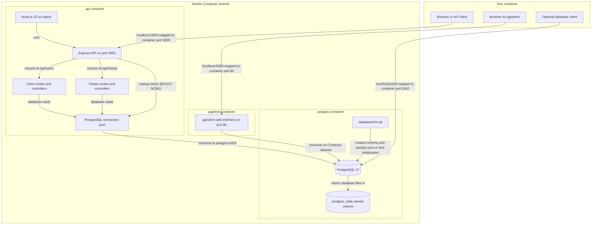
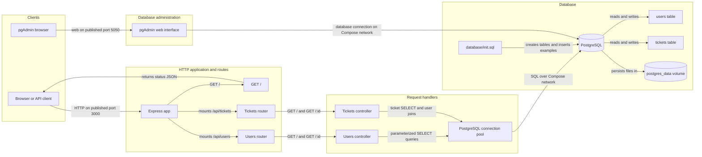

# Architecture Diagram

This guide shows how the Support Ticket System's Docker containers connect and what happens when a person requests users or tickets. It assumes basic Docker familiarity and follows the code currently in this project; the application has read endpoints, but does not yet create, update, or delete records.

## Application Architecture

<!-- mermaid-checked: no \n, no em-dash/en-dash, no {} in labels, subgraphs are id["label"], arrows are -->|"label"|, all subgraphs closed by end, ids unique -->


### Technology Stack Summary

| Layer | Technology | Version | Purpose |
|---|---|---|---|
| Container orchestration | Docker Compose | Not pinned in project | Starts the API, database, and database administration services on a shared network |
| API runtime | Node.js Alpine image | 22 | Runs the JavaScript server in the API container |
| HTTP framework | Express | 5.2.1 range in `package.json` | Receives HTTP requests and routes them to users or tickets handlers |
| PostgreSQL driver | `pg` | 8.23.1 range in `package.json` | Maintains a connection pool and sends SQL queries to PostgreSQL |
| Development runner | nodemon | 3.1.14 range in `package.json` | Runs the API and restarts it when source files change |
| Database | PostgreSQL image | 17 | Stores users and support tickets |
| Database administration | pgAdmin image | `latest` tag | Provides a browser interface for administering the PostgreSQL database |

### Data Storage & External Services

PostgreSQL is the application's data store. The API's `pg` connection pool gets its host, port, database, user, and password from environment variables configured by Compose. Within the Compose network the database hostname is `postgres` and its container port is `5432`. The named volume `postgres_data` stores database files independently from the container lifecycle. On first initialization of an empty data directory, PostgreSQL runs the mounted `database/init.sql`, which creates the `users` and `tickets` tables and inserts demonstration rows. pgAdmin is a separate administration tool that can connect to the database; it is not in the normal API request path.

### Key Architectural Decisions

- The project separates HTTP handling, route mapping, query logic, and database connectivity into `app.js`, route modules, controller modules, and a shared database pool.
- `GET /api/tickets` joins tickets to users to return the creator's and assignee's names alongside ticket details. A left join permits tickets with no assigned agent.
- The API exposes read-only routes at present. Seeded sample data can be read through the API, but there are no implemented create, update, delete, authentication, or authorization endpoints.

## Component Relationships

<!-- mermaid-checked: no \n, no em-dash/en-dash, no {} in labels, subgraphs are id["label"], arrows are -->|"label"|, all subgraphs closed by end, ids unique -->


### Component Inventory

| Component | Layer | Type | Responsibility |
|---|---|---|---|
| Express app | HTTP application | Express application | Enables JSON parsing, registers route modules, performs a startup database check, and listens on port 3000 |
| Root route | HTTP application | `GET /` route | Returns a JSON message indicating that the API process is running |
| Users router | Routes | Express router | Maps `GET /api/users` and `GET /api/users/:id` to user handlers |
| Users controller | Request handlers | Controller functions | Queries user records; returns user ID, name, email, role, and creation time, but not the password field |
| Tickets router | Routes | Express router | Maps `GET /api/tickets` and `GET /api/tickets/:id` to ticket handlers |
| Tickets controller | Request handlers | Controller functions | Queries ticket details and creator/assignee names; returns 404 if a requested ticket does not exist and 500 if a query fails |
| PostgreSQL connection pool | Data access | `pg` pool | Connects to the database using `DB_*` environment variables and executes SQL from both controllers |
| PostgreSQL | Data | Relational database | Stores the users and tickets records |
| `database/init.sql` | Data initialization | SQL script | Defines tables and foreign keys and seeds sample users and tickets on fresh database initialization |
| `postgres_data` | Persistence | Docker named volume | Keeps database files when the database container is recreated |
| pgAdmin | Administration | Web interface | Lets a human connect to and inspect PostgreSQL separately from API traffic |

## What happens for an API request

For example, a request to `GET http://localhost:3000/api/tickets` follows this path:

1. **The browser reaches the API container.** Compose publishes host port 3000 and forwards it to port 3000 in the `api` container.
2. **Express receives the request.** `src/app.js` has mounted the tickets router at `/api/tickets`, so Express sends the remaining path `/` to that router.
3. **The router chooses a controller function.** `src/routes/tickets.js` maps `GET /` to `getTickets`. For an individual ticket, `GET /api/tickets/1` matches `GET /:id` and calls `getTicketById` with `id` equal to `1`.
4. **The controller queries PostgreSQL.** `src/controllers/ticketsController.js` uses the shared pool from `src/config/db.js`. The list query reads tickets and joins `users` twice: once to obtain the creator's name and once to obtain the assigned agent's name. The assignee join is a left join, so an unassigned ticket can still appear.
5. **The query result becomes JSON.** Express serializes the selected row or rows and sends them back over the same HTTP connection. An individual ticket request returns a 404 JSON error if no matching row exists; query errors are logged and return a 500 JSON error.

The user endpoints follow the same route-to-controller-to-pool path. `GET /api/users` lists users, while `GET /api/users/1` fetches one user. Their SQL explicitly selects `id`, `name`, `email`, `role`, and `created_at`; it does not select the `password` column.

At API startup, `src/app.js` separately issues `SELECT NOW()` through the pool as a connectivity check. This startup query is not part of each endpoint request. If PostgreSQL is not ready at that moment, the failure is logged, but the current code does not retry or stop the API from listening.

## Docker Compose connections and ports

Compose defines three services: `api`, `postgres`, and `pgadmin`. Compose puts them on a shared private network by default. On that network, service names act as DNS names, so the API and pgAdmin can connect to the database using hostname `postgres`.

| Service | Container purpose | Host access | Container-to-container access |
|---|---|---|---|
| `api` | Runs Node.js, Express, routes, and controllers | `http://localhost:3000` | Connects to database at `postgres:5432` |
| `postgres` | Runs PostgreSQL 17 | Database tools on the computer can use `localhost:5433` | Other Compose services use `postgres:5432` |
| `pgadmin` | Runs the pgAdmin web interface | `http://localhost:5050` | Connects to database at `postgres:5432` |

In a mapping such as `5433:5432`, the left side is the computer's port and the right side is the container's port. A database client installed directly on the computer uses `localhost:5433`. The API is already inside the Compose network, so it uses `postgres:5432`. Using `localhost` for the API's database host would point back to the API container, not to PostgreSQL.

The `depends_on` settings define service start order: Compose starts `postgres` before `api` and `pgadmin`. They do not guarantee that PostgreSQL has completed initialization and is ready to accept connections. The startup `SELECT NOW()` can therefore fail during a slow database startup even though Compose started PostgreSQL first.

## Volumes and initialization

- **Source bind mount (`./src:/app/src`)**: shares the local `src` directory with the API container. It makes source changes visible in the running development container, where nodemon can restart the server.
- **Database named volume (`postgres_data:/var/lib/postgresql/data`)**: stores PostgreSQL's data directory outside the database container. Stopping, rebuilding, or recreating the container normally retains database records.
- **Initialization script (`./database/init.sql:/docker-entrypoint-initdb.d/init.sql`)**: places the SQL file in the directory PostgreSQL's official image checks when initializing a new data directory. The schema and sample inserts run on first initialization; editing the file later does not rerun it against an already initialized volume.

## Running and resetting the demo

From the project directory, start the services and build the API image with:

```sh
docker compose up --build
```

Try these requests in a browser or API client:

| Request | Expected result |
|---|---|
| `GET http://localhost:3000/` | API status JSON |
| `GET http://localhost:3000/api/users` | JSON array of users |
| `GET http://localhost:3000/api/users/1` | One user, or a 404 JSON response if that ID does not exist |
| `GET http://localhost:3000/api/tickets` | JSON array of tickets with creator and assignee names |
| `GET http://localhost:3000/api/tickets/1` | One ticket, or a 404 JSON response if that ID does not exist |

Open `http://localhost:5050` for pgAdmin. To connect it to this database, add a server connection with host `postgres`, port `5432`, and the database credentials from the Compose configuration. From inside the pgAdmin container, `localhost` means pgAdmin itself, not the PostgreSQL container.

Stop containers but keep database data by running:

```sh
docker compose down
```

To remove the database volume and initialize the sample schema/data from scratch next time, run:

```sh
docker compose down -v
docker compose up --build
```

The `-v` option deletes the Compose-managed `postgres_data` volume and all database contents it holds. Use it only when deliberately resetting the local database.

## Current scope and practical notes

- Implemented HTTP endpoints are read-only: `GET /`, `GET /api/users`, `GET /api/users/:id`, `GET /api/tickets`, and `GET /api/tickets/:id`. There are no implemented user or ticket create/update/delete endpoints, login, or authorization.
- The `users` table contains a `password` column and the initialization file inserts demonstration passwords. The user API query omits the password field, but these seed credentials are not suitable for real use.
- The Compose file contains fixed database and pgAdmin passwords and publishes the database port on the host. Treat these as local demonstration settings, not production configuration.
- `dockerfile` runs `npm run dev`, which invokes nodemon and is suited to development rather than production.
